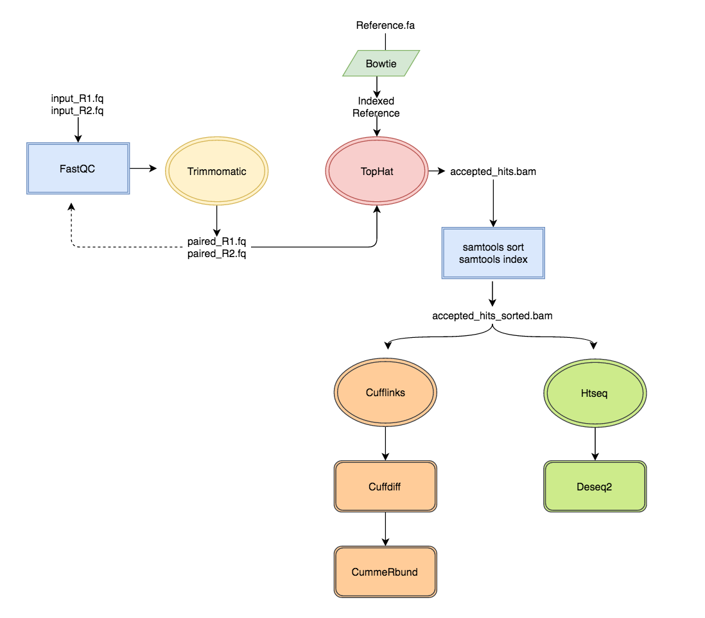

# RNAseq experiments

To analyse expression from RNA-Seq data the steps are the following:

1. **Filter reads** 
1. **Sequence Alignment**
2. **Expression analysis**
	- **Counts of expression**
	- **Differential expression**
3. **Functional annotation** 



## 1.Quality control and filtering

### FastQC
FastQC looks at different quality parameters in the reads and generates a html output that can be oppened in the browser. 

Usage:

```
fastqc <reads1.fastq>
fastqc <reads2.fastq>
```

### Trimmomatic

Trimmomatic includes a variety of processing steps for read trimming and filtering, also identification of adapter sequences and quality filtering. 

The current trimming steps are:

- ``ILLUMINACLIP``: Cut adapter and other illumina-specific sequences from the read. - - SLIDINGWINDOW: Performs a sliding window trimming approach. It starts scanning at the 5‟ end and clips the read once the average quality within the window falls below a threshold.
- ``MAXINFO``: An adaptive quality trimmer which balances read length and error rate to maximise the value of each read
- ``LEADING``: Cut bases off the start of a read, if below a threshold 
quality
- ``TRAILING``: Cut bases off the end of a read, if below a threshold quality
- ``CROP``: Cut the read to a specified length by removing bases from the end HEADCROP: Cut the specified number of bases from the start of the read 
- ``MINLEN``: Drop the read if it is below a specified length
- ``AVGQUAL``: Drop the read if the average quality is below the specified level 
- ``TOPHRED33``: Convert quality scores to Phred-33
- ``TOPHRED64``: Convert quality scores to Phred-64

Usage for Illumina Paired End reads:

```
java -jar trimmomatic-0.33.jar PE -phred33 <reads1.fastq> 
<reads2.fastq> <trimmed_paired_1.fq> <trimmed_unpaired_1.fq> <trimmed_paired_2.fq> <trimmed_unpaired_2.fq> HEADCROP:14 
LEADING:20 TRAILING:20 SLIDINGWINDOW:20:20 MINLEN:20 
ILLUMINACLIP:TruSeq-PE.fa:1:20:10
```

TruSeq-PE.fa is a fasta file containing the sequences for the sequencing adaptors to clip. 


## 2. Alignment 

There are numerous tools performing short read alignment and the choice of aligner should be carefully made according to the analysis goals/requirements. Here we will use Tophat, a widely used ultrafast aligner that performs spliced alignments. Tophat is based on Bowtie (a splice-unaware aligner) to perform alignments and uses an indexed genome to keep its memory footprint small and the running time short.

To produce the alignments a programme specifically designed for RNAseq should be used.  The alignment should be done independently for each of the samples. 

### Index reference

```
bowtie2-build <reference.fa> <index_ref>
```

### Tophat 2

Tophat is the aligner of the tuxedo suite for RNA-Seq analysis. The aligner maps to the reference and can be guided with the annotation. Tophat requires to have a constructed Bowtie2 index in order to do the alignments. 

Check the options [here](https://ccb.jhu.edu/software/tophat/manual.shtml)

Basic usage for PE reads:

```
tophat [options]* <index_ref> <reads_1.fastq> <reads_2.fastq>
```

Options (there are more)

``-g/ --max-multihits <int>`` -  maximum number of multihits allowed. Short reads are likely to map to more than one locations in the genome even though these reads can have originated from only one of these regions. In RNA-seq we allow for a restricted number of multihits, and in this case we ask Tophat to report only reads that map at most onto 2 different loci.

``-r/--mate-inner-dist <int>`` - This is the expected (mean) inner distance between mate pairs. For, example, for paired end runs with fragments selected at 300bp, where each end is 50bp, you should set -r to be 200. The default is 50bp.

``-G/--GTF <GTF/GFF3 file>`` - supply TopHat with a set of gene model annotations and/or known transcripts, as a GTF 2.2 or GFF3 formatted file. If this option is provided, TopHat will first extract the transcript sequences and use Bowtie to align reads to this virtual transcriptome first.

``-o``  - this specifies in which subdirectory *Tophat* should save the output files. Given that for every run the name of the output files is the same, we specify different folders for each run.


## 3. Expression analysis

To quantify the differences in the expression levels on the different gens we used to different packages: cufflinks and HTSeq/DeSeq2. Cufflinks re-annotates the genome and gives a list of expression differences by gene and isoform, HTSeq provides the raw counts of genes per sample and DeSeq2 estimates the expression difference. 

### Cufflinks/Cuffdiff
To analyse the differential expression with cufflinks and cuffdiff two mayor steps are carried on: Transcriptome assembly and differential expression quantification. 


#### Transcriptome assembly

##### 1. Cufflinks

As a first stage, the mapped reads are compared to the annotated genes and the reads that aren't mapped to obtain novel isoforms and a new transcriptome (GTF/GFF file). The process is done on each of the samples. 

```
cufflinks -p8 -b <ref.fa> -G <GFF_file> -o <output_folder> <BAM_file>
```

The relevant parameters in cufflinks are:

- `-b <ref.fa>` The reference genome
- `-p / --num-threads` The number of threads used, the same number was used across the programs for simplicity
-  `-o / --output-dir` The directory with the output from cufflinks
-  `-G / --GTF-guide` The original GTF file.
-  `input/accepted_hits.bam` The alignment produced by Tophat 2

The output folder for each of the samples contain the following files: 

- `genes.fpkm_tracking`  Tracks the expression level for each gene
- `isoforms.fpkm_tracking` Tracks the expression level for each isoform  
- `skipped.gtf`  Genes that are not used in the downstream analysis 
- `transcripts.gtf` The resulting transcript for the sample

##### 2. Cuffmerge 

The next step is to call for a consensus GTF file from `transcripts.gtf`: 

```
mkdir <out>
ls <output_folder>/transcripts.gtf > /assemblies.txt
cuffmerge -s <ref.fa> -g <GFF_file> -o <out>/merged_asm <out>/assemblies.txt
```
The relevant parameters are:

- `-s` The reference genome
- `-g` The GTF file 
- `-o <out>/merged_asm` The new assembly

##### 3. Cuffdiff

Finally, the differential gene expression is calculated using `cuffdiff`. For this, we need to get the list of all the alignment files (BAM files). 

```
cuffdiff -L <A,B,C> -o <out> <merged.gtf> <A1,A2,A3> <B1,B2,B3> <C1,C2,C3>
```

The input parameters are the following:
- `-L` Labels, names of the conditions (A,B,C)
- `-o <out>` The output folder
- `merged.gtf` The resulting GTF file from, from cuffmerge
- `<A1,A2,A3> <B1,B2,B3> <C1,C2,C3>` BAM files. Each block represents a sample. 

The output will be found in the output folder previously specified and created (<out>). It will contain the following files:


- ``FPKM tracking files`` - Cuffdiff calculates the FPKM of each transcript, primary transcript, and gene in each sample.


- ``Count tracking files`` - Cuffdiff estimates the number of fragments that originated from each transcript, primary transcript, and gene in each sample. 


- ``Read group tracking files`` - Cuffdiff calculates the expression and fragment count for each transcript, primary transcript, and gene in each replicate. 


- ``Differential expression tests`` -  tab delimited file lists the results of differential expression testing between samples 

More information about cuffdiff output files can be found [here](http://cole-trapnell-lab.github.io/cufflinks/cuffdiff/#cuffdiff-output-files)

### HtSeq

An alternative way to look calculate the differential expression is to count how many times a read hits a gene and take the number of counts directly, regardless of the size of the gene, as opposed to normalising to the total number of bases on each gene (fpkmm). HTSeq works with paired reads sorted by name. 

First run samtools to convert the BAM files to SAM:

```
samtools view -h <BAM_file> > <SAM_file>
```

Then run htseq-count:

```
htseq-count [options]* <SAM_file> <GFF_file> > output.htseq.txt
```

You can find information about the options [here](http://www-huber.embl.de/HTSeq/doc/count.html)

Now, **merge all the htseq.txt** files into a tab file:

1. Join all files together.  Note: The join command only works if the input is sorted, all the files have the same number of lines and the IDs (gene names) are the same for each one.

```join 1.htseq.txt 2.htseq.txt | join - 3.txt | ...  > merge_htseq.txt```

2. Add the names of the libraries at the top of the htseq file 

```sed -i '1s/^/genes	<1>	<2> /n /' merge_htseq.txt```

3. After using join, the fields are separated by spaces and not by tabs, so we have to replace spaces by tabs using:

```tr ' ' '\t' < merge_htseq.txt > merge_htseq_tab.txt```